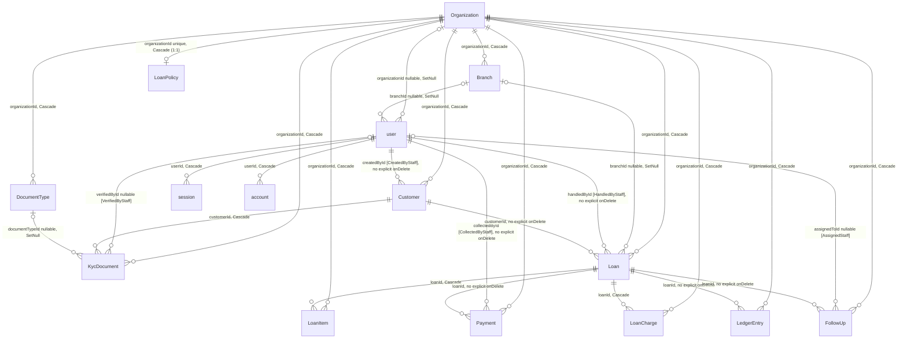

# Pawnify Database Schema

## 1. Scope and Subsystem Legend

This document describes the physical PostgreSQL data layer shared by both subsystems in this monorepo:

- backend/ — a new, partial NestJS API. Only 7 modules exist (auth, cron, customers, health, market-rates, organizations, storage, webhooks). Its own database code touches only 3 repository files.
- web/ — the mature Next.js 15 full-stack app (App Router, Prisma, Supabase, better-auth, Redux Toolkit Query). It still owns essentially all business logic that operates on this schema (loans, payments, KYC, followups, billing, reports, dashboard, staff, settings) — roughly 90 direct Prisma call sites across ~20 files.

Both subsystems are driven by exactly **one** Prisma schema file, physically duplicated: backend/prisma/schema.prisma and web/prisma/schema.prisma. Every fact in this document about models, enums, relations, indexes, and constraints was verified directly against both files (diff, zero output, exit code 0 — byte-identical, 436 lines each) and applies equally to both unless a section explicitly says otherwise. Every claim below is tagged, where it matters, with which subsystem's *code* (not schema) actually exercises it — the schema is shared, the usage is not.

There is no monorepo tooling (no turbo.json, nx.json, pnpm-workspace.yaml, lerna.json) and no CI of any kind (no .github directory anywhere in the repo). backend/ and web/ are two independent npm projects with independent package-lock.json files. Nothing automatically keeps their two schema.prisma copies in sync — see Section 14.

## 2. Entity-Relationship Diagram

Entity names below match Prisma model names exactly (case-sensitive — user/session/account/verification are deliberately lowercase for better-auth compatibility; every other model is PascalCase). Cardinality symbol placement follows standard crow's-foot notation: the symbol next to an entity describes how many rows of *that* entity relate to one row of the entity on the other side.



Notes on what this diagram deliberately omits (backend/prisma/schema.prisma, web/prisma/schema.prisma):

- **verification** and **AppSetting** have zero relations to any other table (no FK columns at all) and are not drawn as edges — they are structurally standalone.
- Three fields are named/commented like foreign keys but have **no** Prisma `@relation` and are not drawn as edges here: Loan.closedById, LoanPolicy.mandatoryIdDocTypeId, LedgerEntry.referenceId. See Section 16.
- There are **no many-to-many relations anywhere in this schema** — every relation is 1:1 (Organization–LoanPolicy only) or 1:N.

## 3. Enums

All 12 enums are defined in backend/prisma/schema.prisma and web/prisma/schema.prisma, lines 14-89 (identical text in both). No enum or enum value uses `@map`.

| Enum | Values | Used as default on | Values never exercised by seed data (backend/prisma/seed.ts, web/prisma/seed.ts) |
|---|---|---|---|
| Role | PLATFORM_OPERATOR, OWNER, ADMIN, BRANCH_MANAGER, STAFF | user.role → STAFF | PLATFORM_OPERATOR, OWNER, BRANCH_MANAGER |
| MetalType | GOLD, SILVER | — (required, no default) | none (both used) |
| WeightUnit | GRAM, TROY_OUNCE, TOLA | LoanPolicy.weightUnit → GRAM | TROY_OUNCE, TOLA |
| PurityExpression | KARAT, MILLESIMAL_FINENESS, PERCENTAGE | LoanPolicy.purityExpression → KARAT | MILLESIMAL_FINENESS, PERCENTAGE |
| DayCountConvention | ACTUAL_365, ACTUAL_360, THIRTY_360 | LoanPolicy.dayCountConvention → ACTUAL_365 | ACTUAL_360, THIRTY_360 (and see Section 13 — even ACTUAL_365 is configured but never actually read by the interest formula) |
| LoanStatus | ACTIVE, CLOSED | Loan.status → ACTIVE | There is **no OVERDUE/DEFAULTED/AUCTIONED value**. "Overdue" is a derived, read-time label computed elsewhere (web/src/lib/services/loans.ts), never a stored column value — confirmed directly in backend/prisma/seed.ts, where loans explicitly commented "OVERDUE" (loans #3, #4, #10) are still created with the literal status "ACTIVE" (line 753) |
| KycDocType | AADHAAR, PAN, VOTER_ID, PASSPORT, DRIVING_LICENSE, CUSTOM | KycDocument.docType → CUSTOM | DRIVING_LICENSE, CUSTOM |
| KycStatus | PENDING, VERIFIED, REJECTED | KycDocument.status → PENDING | none (all three used) |
| PaymentMode | CASH, UPI, BANK_TRANSFER, CARD | — (required, no default) | CARD |
| ChargeType | PROCESSING_FEE, PENAL_CHARGE, OTHER | — (required, no default) | PENAL_CHARGE, OTHER |
| TransactionType | DISBURSEMENT, PAYMENT, CLOSURE, ITEM_RELEASE | — (required, no default) | none (all four used) |
| FollowUpStatus | PENDING, DONE, CANCELLED | FollowUp.status → PENDING | CANCELLED |

## 4. Tables — Tenancy & Configuration

Decimal fields are declared as `Decimal @db.Decimal(P, S)` where P = total significant digits, S = digits after the decimal point; max magnitude = `10^(P-S) − 10^-S`.

### Organization (backend/prisma/schema.prisma lines 93-113)

| Field | Type | Nullable | Default | Notes |
|---|---|---|---|---|
| id | String | No | cuid() | PK |
| name | String | No | — | |
| slug | String | No | — | `@unique` |
| billingPlan | String? | Yes | — | Informal convention, not a Prisma enum: null = self-hosted; "starter"\|"growth"\|"enterprise"\|"trial" = cloud. Seed value: "enterprise" (backend/prisma/seed.ts line 64) |
| createdAt | DateTime | No | now() | |
| updatedAt | DateTime | No | @updatedAt | |

Relations: back-references only (branches, users, customers, loans, loanItems, loanCharges, payments, ledgerEntries, followUps, kycDocuments, loanPolicy?, documentTypes) — this is the tenant root; nearly every other table cascades from it. Constraints: field-level unique on slug only, no `@@index`, no compound `@@unique`.

### Branch (lines 115-128)

| Field | Type | Nullable | Default | Notes |
|---|---|---|---|---|
| id | String | No | cuid() | PK |
| organizationId | String | No | — | FK → Organization.id, onDelete Cascade |
| name | String | No | — | |
| address | String? | Yes | — | |
| createdAt | DateTime | No | now() | |
| updatedAt | DateTime | No | @updatedAt | |

Indexes: `@@index([organizationId])` only — no unique on (organizationId, name), so two branches in the same org can share a name.

### LoanPolicy (lines 130-145)

The only true 1:1 relation in the schema (organizationId is both the FK and `@unique`).

| Field | Type | Nullable | Default | Notes |
|---|---|---|---|---|
| id | String | No | cuid() | PK |
| organizationId | String | No | — | FK → Organization.id, `@unique`, onDelete Cascade — makes this 1:1 |
| currencyCode | String | No | "USD" | ISO 4217 (comment only, not DB-enforced) |
| currencySymbol | String | No | "$" | |
| weightUnit | WeightUnit | No | GRAM | |
| purityExpression | PurityExpression | No | KARAT | |
| dayCountConvention | DayCountConvention | No | ACTUAL_365 | |
| gracePeriodDays | Int | No | 7 | |
| mandatoryIdThreshold | Decimal(12,2) | No | 0 | 0 = disabled (comment); max ~9,999,999,999.99 |
| mandatoryIdDocTypeId | String? | Yes | — | **Not a Prisma relation** — see Section 16 |
| ltvTiers | Json | No | — (no default) | Shape per comment only: array of `{maxValue: number\|null, ltvPercent: number}`, ascending. Not enforced by any DB constraint |
| createdAt | DateTime | No | now() | |
| updatedAt | DateTime | No | @updatedAt | |

Indexes: none beyond the implicit unique index on organizationId.

### DocumentType (lines 147-160)

| Field | Type | Nullable | Default | Notes |
|---|---|---|---|---|
| id | String | No | cuid() | PK |
| organizationId | String | No | — | FK → Organization.id, onDelete Cascade |
| name | String | No | — | e.g. "Passport", "Aadhaar", "PAN", "SSN", "Driver's License" (comment) |
| isPrimaryId | Boolean | No | false | Nothing prevents more than one row per org from being true — confirmed in backend/prisma/seed.ts, where both "PAN Card" and "Passport" are seeded with isPrimaryId: true simultaneously (lines 94-105) |
| maskingRule | String? | Yes | — | e.g. "last4" (comment) |
| createdAt | DateTime | No | now() | |
| updatedAt | DateTime | No | @updatedAt | |

Indexes: `@@index([organizationId])` only — no unique on (organizationId, name).

## 5. Tables — Better Auth Identity

Schema section header comment: "BETTER AUTH TABLES" (backend/prisma/schema.prisma line 162). Confirmed as the live authentication engine for web/ by reading web/src/lib/auth.ts directly: `betterAuth({ database: prismaAdapter(prisma, { provider: "postgresql" }), emailAndPassword: { enabled: true }, user: { additionalFields: { role, phone, isActive } } })`. role and isActive are declared `input: false` there, meaning they can never be set from a public sign-up payload — corroborated by backend/prisma/seed.ts's comment (lines 132-134) and its own two-step pattern (auth.api.signUpEmail, then a separate prisma.user.update to set role/isActive/organizationId/branchId).

### user (lowercase; lines 164-195)

| Field | Type | Nullable | Default | Notes |
|---|---|---|---|---|
| id | String | No | — (no @default) | PK. Supplied externally by better-auth's own ID generation, not Prisma cuid() |
| name | String | No | — | |
| email | String | No | — | `@unique` |
| emailVerified | Boolean | No | false | |
| image | String? | Yes | — | |
| createdAt | DateTime | No | now() | |
| updatedAt | DateTime | No | @updatedAt | |
| role | Role | No | STAFF | `input: false` in web/src/lib/auth.ts — never settable from public sign-up |
| phone | String? | Yes | — | `input: true` — settable at sign-up |
| isActive | Boolean | No | true | `input: false`. Functional/business flag, not a soft-delete marker — e.g. backend/src/modules/organizations/organizations.repository.ts's removeTeamMember sets `isActive: false, organizationId: null` on offboarding, it does not hide the row from ordinary queries |
| passwordHash | String? | Yes | — | Whether this is actually populated anywhere (vs. the credential hash living on account.password) is Unknown from these files alone |
| organizationId | String? | Yes | — | FK → Organization.id, onDelete SetNull |
| branchId | String? | Yes | — | FK → Branch.id, onDelete SetNull |

Relations: sessions session[], accounts account[], plus five named back-relations to domain tables (customersCreated "CreatedByStaff", loansHandled "HandledByStaff", paymentsCollected "CollectedByStaff", followUpsAssigned "AssignedStaff", kycVerified "VerifiedByStaff"). Indexes: `@@index([organizationId])`, `@@index([branchId])` — two separate single-column indexes, not composite.

**This model carries the identical tenant-scoping shape (organizationId, branchId) as every RLS-protected domain table below, yet has zero RLS coverage — see Section 15.**

### session (lines 197-207)

| Field | Type | Nullable | Default | Notes |
|---|---|---|---|---|
| id | String | No | — | PK |
| expiresAt | DateTime | No | — (no default) | |
| token | String | No | — | `@unique` |
| createdAt | DateTime | No | now() | |
| updatedAt | DateTime | No | @updatedAt | |
| ipAddress | String? | Yes | — | |
| userAgent | String? | Yes | — | |
| userId | String | No | — | FK → user.id, onDelete Cascade |

Indexes: none at all — not even on userId (only token is indexed, via its field-level unique). No organizationId column.

### account (lines 209-224)

| Field | Type | Nullable | Default | Notes |
|---|---|---|---|---|
| id | String | No | — | PK |
| accountId | String | No | — | Provider's own account/user identifier |
| providerId | String | No | — | e.g. "credential" |
| userId | String | No | — | FK → user.id, onDelete Cascade |
| accessToken | String? | Yes | — | |
| refreshToken | String? | Yes | — | |
| idToken | String? | Yes | — | |
| accessTokenExpiresAt | DateTime? | Yes | — | |
| refreshTokenExpiresAt | DateTime? | Yes | — | |
| scope | String? | Yes | — | |
| password | String? | Yes | — | Credential-flow password hash |
| createdAt | DateTime | No | now() | |
| updatedAt | DateTime | No | @updatedAt | |

Indexes/constraints: none — no `@@unique([providerId, accountId])`, no `@@index([userId])`. Nothing at the schema level prevents duplicate linked-account rows.

### verification (lines 226-233)

| Field | Type | Nullable | Default | Notes |
|---|---|---|---|---|
| id | String | No | — | PK |
| identifier | String | No | — | |
| value | String | No | — | |
| expiresAt | DateTime | No | — (no default) | |
| createdAt | DateTime? | **Yes** | now() | Nullable-with-default — asymmetric with every other model's createdAt, which is non-null |
| updatedAt | DateTime? | **Yes** | @updatedAt | Also nullable, unlike every other updatedAt in the file |

No relation to user (looked up by identifier, e.g. email, not userId). No `@@index`/`@@unique` at all, not even on identifier despite it being the natural lookup key.

**session, account, and verification hold session tokens and password hashes but have no organizationId column (correctly outside the organizationId-keyed RLS scheme by design) and, per Section 15, no RLS or userId-level policy protection of any kind either.**

## 6. Tables — Domain Models

### Customer (lines 237-262)

| Field | Type | Nullable | Default | Notes |
|---|---|---|---|---|
| id | String | No | cuid() | PK |
| organizationId | String | No | — | FK → Organization.id, onDelete Cascade |
| fullName | String | No | — | |
| phone | String | No | — | No DB-level format check |
| email | String? | Yes | — | |
| dob | DateTime? | Yes | — | |
| addressLine1 | String | No | — | |
| addressLine2 | String? | Yes | — | |
| city | String | No | — | |
| state | String | No | — | |
| pincode | String | No | — | |
| photoUrl | String? | Yes | — | |
| createdById | String | No | — | FK → user.id via "CreatedByStaff", **no explicit onDelete** |
| createdAt | DateTime | No | now() | |
| updatedAt | DateTime | No | @updatedAt | |

Constraints: `@@unique([organizationId, phone])` (unique per org, not globally). Indexes: `@@index([organizationId])`, `@@index([fullName])`.

### KycDocument (lines 264-282)

| Field | Type | Nullable | Default | Notes |
|---|---|---|---|---|
| id | String | No | cuid() | PK |
| organizationId | String | No | — | FK → Organization.id, onDelete Cascade |
| customerId | String | No | — | FK → Customer.id, onDelete Cascade |
| docType | KycDocType | No | CUSTOM | |
| documentTypeId | String? | Yes | — | FK → DocumentType.id, onDelete SetNull |
| docNumber | String | No | — | **No uniqueness constraint at any scope** despite representing a government ID number |
| fileUrl | String? | Yes | — | |
| status | KycStatus | No | PENDING | |
| verifiedById | String? | Yes | — | FK → user.id via "VerifiedByStaff", no explicit onDelete |
| createdAt | DateTime | No | now() | **No updatedAt** — a PENDING→VERIFIED/REJECTED transition leaves no timestamp |

Indexes: `@@index([organizationId])`, `@@index([customerId])`.

### Loan (lines 286-329)

| Field | Type | Nullable | Default | Notes |
|---|---|---|---|---|
| id | String | No | cuid() | PK |
| organizationId | String | No | — | FK → Organization.id, onDelete Cascade |
| branchId | String? | Yes | — | FK → Branch.id, onDelete SetNull |
| loanNumber | String | No | — | e.g. "PL-2026-000001" |
| customerId | String | No | — | FK → Customer.id, no explicit onDelete |
| handledById | String | No | — | FK → user.id via "HandledByStaff", no explicit onDelete |
| loanDate | DateTime | No | now() | |
| dueDate | DateTime | No | — (no default; app-computed as loanDate + tenureMonths) | |
| tenureMonths | Int | No | — | |
| interestRateMonthly | Decimal(6,3) | No | — | Max ~999.999 |
| ltvPercent | Decimal(5,2) | No | — | Max ~999.99 |
| gracePeriodDays | Int | No | 7 | Per-loan snapshot, independent of LoanPolicy.gracePeriodDays (also defaults to 7) — no DB constraint links the two |
| totalAssessedValue | Decimal(12,2) | No | — | Max ~9,999,999,999.99 |
| principalAmount | Decimal(12,2) | No | — | |
| principalOutstanding | Decimal(12,2) | No | — | |
| lastSettledDate | DateTime | No | now() | Anchor date for next interest accrual |
| status | LoanStatus | No | ACTIVE | Only ACTIVE/CLOSED — see Section 3 |
| closedAt | DateTime? | Yes | — | |
| closedById | String? | Yes | — | **Not a Prisma relation** — see Section 16 |
| notes | String? | Yes | — | |
| createdAt | DateTime | No | now() | |
| updatedAt | DateTime | No | @updatedAt | |

Constraints: `@@unique([organizationId, loanNumber])`. Indexes: `@@index([organizationId])`, `@@index([status])`, `@@index([dueDate])`, `@@index([customerId])`. **No index on branchId, handledById, or loanDate** despite all three being plausible/actual filter columns (see Section 9).

### LoanItem (lines 331-359)

| Field | Type | Nullable | Default | Notes |
|---|---|---|---|---|
| id | String | No | cuid() | PK |
| organizationId | String | No | — | FK → Organization.id, onDelete Cascade |
| loanId | String | No | — | FK → Loan.id, onDelete Cascade |
| metalType | MetalType | No | — (no default) | |
| description | String | No | — | |
| purityLabel | String | No | — | Freeform display label, e.g. "22K" |
| purityPercent | Decimal(5,2) | No | — | Max ~999.99 |
| grossWeightGrams | Decimal(10,4) | No | — | Max ~999999.9999 |
| stoneWeightGrams | Decimal(10,4) | No | 0 | |
| netWeightGrams | Decimal(10,4) | No | — | App-computed (gross − stone), not a DB-generated column |
| fineWeightGrams | Decimal(10,4) | No | — | App-computed (net × purity/100) |
| valuationRatePerGram | Decimal(10,2) | No | — | Max ~99999999.99 |
| assessedValue | Decimal(12,2) | No | — | App-computed (fine × rate) |
| packetNumber | String | No | — | |
| storageLocation | String | No | — | |
| photoUrl | String? | Yes | — | |
| releasedAt | DateTime? | Yes | — | Set when the physical item is returned |
| createdAt | DateTime | No | now() | **No updatedAt** — releasedAt is the only post-creation timestamp; a storageLocation move, for example, would be untimestamped |

Constraints: `@@unique([organizationId, packetNumber])`. Indexes: `@@index([organizationId])`, `@@index([loanId])`.

### LoanCharge (lines 361-374)

| Field | Type | Nullable | Default | Notes |
|---|---|---|---|---|
| id | String | No | cuid() | PK |
| organizationId | String | No | — | FK → Organization.id, onDelete Cascade |
| loanId | String | No | — | FK → Loan.id, onDelete Cascade |
| chargeType | ChargeType | No | — (no default) | |
| amount | Decimal(12,2) | No | — | |
| isSettled | Boolean | No | false | |
| createdAt | DateTime | No | now() | **No updatedAt** — toggling isSettled leaves no timestamp trail |

Indexes: `@@index([organizationId])`, `@@index([loanId])`. No `@@unique` of any kind on this model.

### Payment (lines 376-397)

| Field | Type | Nullable | Default | Notes |
|---|---|---|---|---|
| id | String | No | cuid() | PK |
| organizationId | String | No | — | FK → Organization.id, onDelete Cascade |
| loanId | String | No | — | FK → Loan.id, **no explicit onDelete** |
| receiptNumber | String | No | — | e.g. "REC-20260706-00001" |
| paymentDate | DateTime | No | now() | |
| amountPaid | Decimal(12,2) | No | — | |
| mode | PaymentMode | No | — (no default) | |
| allocatedCharges | Decimal(12,2) | No | 0 | |
| allocatedInterest | Decimal(12,2) | No | 0 | |
| allocatedPrincipal | Decimal(12,2) | No | 0 | |
| collectedById | String | No | — | FK → user.id via "CollectedByStaff", no explicit onDelete |
| notes | String? | Yes | — | |
| createdAt | DateTime | No | now() | **No updatedAt** — payments are treated as append-only by convention, not DB enforcement |

Constraints: `@@unique([organizationId, receiptNumber])`. Indexes: `@@index([organizationId])`, `@@index([loanId])`. **Nothing at the DB level enforces amountPaid = allocatedCharges + allocatedInterest + allocatedPrincipal** (no CHECK constraint).

### LedgerEntry (lines 399-413)

| Field | Type | Nullable | Default | Notes |
|---|---|---|---|---|
| id | String | No | cuid() | PK |
| organizationId | String | No | — | FK → Organization.id, onDelete Cascade |
| loanId | String | No | — | FK → Loan.id, **no explicit onDelete** |
| type | TransactionType | No | — (no default) | |
| amount | Decimal(12,2) | No | — | |
| principalAfter | Decimal(12,2) | No | — | Running-balance snapshot after this transaction |
| referenceId | String? | Yes | — | **Not a Prisma relation** — see Section 16. Never populated by seed data (backend/prisma/seed.ts creates every LedgerEntry row without setting this field) |
| description | String | No | — | Freeform; seed data embeds computed currency amounts directly into this text |
| createdAt | DateTime | No | now() | **No updatedAt** — the model most explicitly framed elsewhere (.agents/context.md) as an "immutable" audit trail, and its create-only column shape is at least consistent with that intent, though nothing in the schema or backend/sql/rls_policies.sql (no triggers, no REVOKE UPDATE/DELETE) actually enforces immutability at the DB level — it is a convention, not a constraint |

Indexes: a single compound `@@index([organizationId, loanId, createdAt])` — structurally different from every sibling model, which each get two separate single-column indexes instead (see Section 9).

### FollowUp (lines 415-430)

| Field | Type | Nullable | Default | Notes |
|---|---|---|---|---|
| id | String | No | cuid() | PK |
| organizationId | String | No | — | FK → Organization.id, onDelete Cascade |
| loanId | String | No | — | FK → Loan.id, **no explicit onDelete** |
| note | String | No | — | |
| dueDate | DateTime | No | — (no default) | |
| status | FollowUpStatus | No | PENDING | |
| assignedToId | String? | Yes | — | FK → user.id via "AssignedStaff", no explicit onDelete |
| createdAt | DateTime | No | now() | **No updatedAt** — a PENDING→DONE/CANCELLED transition overwrites status in place with no timestamp of when it happened |

Indexes: `@@index([organizationId])`, `@@index([loanId])`.

## 7. Tables — Global Settings

### AppSetting (lines 432-435)

The only model with no organizationId, no createdAt/updatedAt, and no cuid id — a flat, structurally distinct, genuinely global key-value store.

| Field | Type | Nullable | Default | Notes |
|---|---|---|---|---|
| key | String | No | — | PK (the key text itself, not a generated id) |
| value | String | No | — | Always a string — no numeric/boolean/JSON variant. Confirmed in use by backend/src/modules/market-rates/market-rates.repository.ts (getSettingsByKeys/upsertSetting, no organizationId filter) |

Seed data (backend/prisma/seed.ts lines 114-123, verified directly): 8 rows — ltv.tier1.max=250000, ltv.tier1.percent=85, ltv.tier2.max=500000, ltv.tier2.percent=80, ltv.tier3.percent=75, interest.default.monthly=1.500, grace.period.days=7, pan.threshold=50000. **These values duplicate settings already present, per-organization, in LoanPolicy** (same seed run's LoanPolicy: ltvTiers JSON encodes the identical 3-tier ladder, gracePeriodDays=7, mandatoryIdThreshold=50000 — backend/prisma/seed.ts lines 76-92 vs. 114-123). Neither file explains why both a global flat table and a per-org structured table encode the same settings; interestRateMonthly values actually used by seeded loans (1.25/1.5/1.8/2.0) don't even match the "default" of 1.500, suggesting this AppSetting value is not read by the loan-creation path. There is no dedicated "MarketRate" model anywhere in the schema despite the backend/src/modules/market-rates module's name — that module persists exclusively through this table.

## 8. Foreign-Key / Relation Map (Consolidated)

"Not specified" = the `onDelete` attribute is omitted from schema.prisma, not that a specific action was deliberately chosen; Prisma/Postgres apply an implicit default in that case that is not stated in the schema text (Unknown from source alone).

| Child.field | → Parent.id | onDelete | Required |
|---|---|---|---|
| Branch.organizationId | Organization | Cascade | Yes |
| LoanPolicy.organizationId | Organization | Cascade | Yes (also `@unique` → 1:1) |
| DocumentType.organizationId | Organization | Cascade | Yes |
| user.organizationId | Organization | SetNull | No |
| user.branchId | Branch | SetNull | No |
| session.userId | user | Cascade | Yes |
| account.userId | user | Cascade | Yes |
| Customer.organizationId | Organization | Cascade | Yes |
| Customer.createdById | user ("CreatedByStaff") | not specified | Yes |
| KycDocument.organizationId | Organization | Cascade | Yes |
| KycDocument.customerId | Customer | Cascade | Yes |
| KycDocument.documentTypeId | DocumentType | SetNull | No |
| KycDocument.verifiedById | user ("VerifiedByStaff") | not specified | No |
| Loan.organizationId | Organization | Cascade | Yes |
| Loan.branchId | Branch | SetNull | No |
| Loan.customerId | Customer | not specified | Yes |
| Loan.handledById | user ("HandledByStaff") | not specified | Yes |
| LoanItem.organizationId | Organization | Cascade | Yes |
| LoanItem.loanId | Loan | Cascade | Yes |
| LoanCharge.organizationId | Organization | Cascade | Yes |
| LoanCharge.loanId | Loan | Cascade | Yes |
| Payment.organizationId | Organization | Cascade | Yes |
| Payment.loanId | Loan | not specified | Yes |
| Payment.collectedById | user ("CollectedByStaff") | not specified | Yes |
| LedgerEntry.organizationId | Organization | Cascade | Yes |
| LedgerEntry.loanId | Loan | not specified | Yes |
| FollowUp.organizationId | Organization | Cascade | Yes |
| FollowUp.loanId | Loan | not specified | Yes |
| FollowUp.assignedToId | user ("AssignedStaff") | not specified | No |

**Notable asymmetry under the Loan aggregate**: LoanItem and LoanCharge cascade-delete with their parent Loan; Payment, LedgerEntry, and FollowUp do not specify an onDelete for their Loan relation at all. This exact dependency ordering is empirically confirmed by backend/prisma/seed.ts's cleanup block (lines 40-55), which deletes ledgerEntry, payment, loanCharge, followUp, loanItem — in that order — before deleting loan, then kycDocument before customer, then session/account before user, then user before organization, then organization last before appSetting.

## 9. Index and Unique-Constraint Inventory (Consolidated)

**Field-level `@unique`**: Organization.slug, user.email, session.token, LoanPolicy.organizationId (also the 1:1 FK).

**Compound `@@unique`**: Customer [organizationId, phone]; Loan [organizationId, loanNumber]; LoanItem [organizationId, packetNumber]; Payment [organizationId, receiptNumber]. In Postgres, a `@@unique` is implemented as a unique B-tree index — there is no separate "constraint vs. index" object here.

**`@@index` declarations**:

| Model | Indexed columns |
|---|---|
| Branch | [organizationId] |
| DocumentType | [organizationId] |
| user | [organizationId], [branchId] (two separate) |
| Customer | [organizationId], [fullName] (two separate) |
| KycDocument | [organizationId], [customerId] (two separate) |
| Loan | [organizationId], [status], [dueDate], [customerId] (four separate) |
| LoanItem | [organizationId], [loanId] (two separate) |
| LoanCharge | [organizationId], [loanId] (two separate) |
| Payment | [organizationId], [loanId] (two separate) |
| LedgerEntry | **one compound** [organizationId, loanId, createdAt] — structurally different from every model above |
| FollowUp | [organizationId], [loanId] (two separate) |

**No `@@index` at all on**: Organization, LoanPolicy, session, account, verification, AppSetting.

### Confirmed index/query-pattern gaps (code audit, verified against this schema)

These are concrete, verified findings — not hypothetical — showing where the index shape above does not match how the code actually queries these tables. All apply to web/ unless noted; backend/ shares the identical schema-level gap in every case (same schema.prisma file) but has no runtime code hitting most of these paths yet.

| Gap | Detail | Source |
|---|---|---|
| Substring search cannot use any existing index | Every customer/loan search filters via Prisma `contains` (mostly `mode: "insensitive"`) against fullName/phone/email/loanNumber/packetNumber, which compiles to Postgres `ILIKE '%term%'`. A B-tree index — all `@@index([fullName])` is, and all Prisma supports declaratively — only accelerates equality/prefix matches, not substrings. No pg_trgm extension, GIN/GIST trigram index, or functional lower() index exists anywhere in either schema.prisma. Correction to an earlier internal claim: phone, loanNumber, and packetNumber are *not* fully unindexed — each is the trailing column of a composite `@@unique([organizationId, ...])` — but a leading-`organizationId` composite index still cannot serve a substring search on the trailing column, and these queries don't filter by organizationId anyway. Only Customer.email is truly index-free. | web/src/lib/services/customers.ts lines 74-79, 136; web/src/lib/services/loans.ts lines 324-341; backend/src/modules/customers/customers.repository.ts lines 15-18 |
| LedgerEntry has no standalone loanId index | Every sibling transaction-adjacent model (LoanItem, LoanCharge, Payment, FollowUp) declares both `@@index([organizationId])` and a separate `@@index([loanId])`. LedgerEntry declares only the compound `[organizationId, loanId, createdAt]`. getLoanById queries `ledgerEntry.findMany({where: {loanId: id}, orderBy: {createdAt: "asc"}})` — loanId alone, with organizationId as the *leading* column of the only index, so Postgres cannot seek on loanId alone. | web/src/lib/services/loans.ts line 249; backend/prisma/schema.prisma, web/prisma/schema.prisma lines 399-413 |
| Loan.loanDate and Payment.paymentDate have no index | Loan indexes organizationId/status/dueDate/customerId but not loanDate; Payment indexes organizationId/loanId but not paymentDate. Dashboard aggregates filter both by date range on every page load. | web/src/lib/services/dashboard.ts lines 71-82, 113-117 |
| FollowUp has no index touching status or dueDate | Only `@@index([organizationId])` and `@@index([loanId])` exist. Both the dashboard's pending-followups KPI and the Follow-ups list page filter/sort by status and dueDate together. | web/src/lib/services/dashboard.ts lines 119-124; web/src/app/(app)/followups/actions.ts lines 16-31 |
| Loan.handledById has no index | Used as a direct filter (`where.handledById`) in getLoans and in a staff-scoped count. | web/src/lib/services/loans.ts lines 292, 313-315; web/src/app/(app)/admin/staff/actions.ts line 181 |

## 10. Confirmed Query-Scoping and Pagination Risks Touching This Schema

These findings don't change the schema itself but directly bear on how safely/effectively its indexes and RLS design (Section 15) are actually being exercised in the current codebase. All apply to web/ (backend/'s 7 modules don't yet have dashboard/loans/payments/followups/reports code).

**Missing organizationId scoping on live queries** (reinforces the RLS gap in Section 15 — if RLS isn't actually engaged, an unscoped Prisma query has no tenant boundary at all):
- web/src/lib/services/dashboard.ts's getDashboardChartData (lines 168-268) and getDashboardStats (lines 13-166): unfiltered, unbounded `prisma.loan.findMany`/`prisma.payment.findMany`/`prisma.loan.aggregate` calls, no organizationId anywhere in the file.
- web/src/app/(app)/reports/actions.ts's getReportsDataAction (lines 7-107): three unfiltered, unbounded queries (loan, payment, loanCharge), duplicating dashboard.ts's pattern in a separate, divergent code path (there is no web/src/lib/services/reports.ts).
- web/src/app/(app)/followups/actions.ts's getFollowUpsAction (lines 9-71): unfiltered, unbounded followUp and loan queries.
- web/src/app/(app)/admin/staff/actions.ts's getStaffListAction (lines 9-42): `prisma.user.findMany` with no where clause at all — every organization's staff roster is queryable from any admin session at the application layer.
- backend/src/modules/customers/customers.repository.ts's searchCustomers: `prisma.customer.findMany` with no organizationId filter (Section 4 of this document already lists Customer as RLS-protected — whether that protection is actually engaged for this specific connection is exactly the open question in Section 15).

**Pagination-contract mismatches** (the schema's page/pageSize/skip/take design intent is undermined at the UI layer, not the schema layer): web/src/app/(app)/customers/customers-list-client.tsx and web/src/app/(app)/loans/loans-list-client.tsx hardcode `pageSize: 100` with no page-changing handler, while the underlying getCustomers/getLoans service functions (web/src/lib/services/customers.ts, web/src/lib/services/loans.ts) do correctly implement server-side skip/take/total/totalPages; web/src/app/(app)/platform-admin/page.tsx's Organization list and the admin/staff endpoints have no pagination at either layer.

**Derived-status query cost**: LoanStatus has no OVERDUE value (Section 3). web/src/lib/services/loans.ts's getLoans, for `filters.status` of ACTIVE or OVERDUE, cannot express the split as a WHERE clause (loans.ts lines 354-359 comment explains this), so it fetches every matching row unfiltered by pagination and paginates in memory (lines 361-381) — the default, most-visited tab of the Loans list.

## 11. Soft-Delete Strategy

**None found.** A full field-by-field review of all 17 models in backend/prisma/schema.prisma / web/prisma/schema.prisma finds no deletedAt, isDeleted, archivedAt, or equivalent column on any model. Deletion is exclusively physical/hard-delete. This is corroborated empirically by backend/prisma/seed.ts's own re-seed cleanup block (lines 40-55), which issues `prisma.<model>.deleteMany()` for ledgerEntry, payment, loanCharge, followUp, loanItem, loan, kycDocument, customer, documentType, loanPolicy, branch, session, account, user, organization, appSetting, in FK-safe order — a pattern that is only necessary because no soft-delete flag exists to set instead.

The one flag that could be mistaken for soft-delete, user.isActive, is a functional/business toggle (used e.g. by backend/src/modules/organizations/organizations.repository.ts's removeTeamMember to offboard staff), not a query-hiding soft-delete marker — rows with isActive=false remain fully visible to any query that doesn't explicitly filter on it.

## 12. Audit Fields

| Coverage | Models |
|---|---|
| createdAt (@default(now())) | Every model **except** AppSetting |
| updatedAt (@updatedAt) | Organization, Branch, LoanPolicy, DocumentType, user, session, account, verification (nullable variant), Customer, Loan |
| **No updatedAt** | KycDocument, LoanItem, LoanCharge, Payment, LedgerEntry, FollowUp, AppSetting — every "event/transaction-shaped" domain model is create-only at the column level, even though several are mutated post-creation in practice (FollowUp.status, LoanItem.releasedAt, LoanCharge.isSettled, KycDocument.status/verifiedById) with no column recording when that mutation happened |

**Actor-attribution fields** (no generic createdBy/updatedBy pair exists anywhere — each model instead has its own purpose-named, separately-`@relation`'d field): Customer.createdById ("CreatedByStaff"), Loan.handledById ("HandledByStaff"), Payment.collectedById ("CollectedByStaff"), KycDocument.verifiedById ("VerifiedByStaff", nullable), FollowUp.assignedToId ("AssignedStaff", nullable). The one exception is Loan.closedById, which is semantically the same kind of field but has no `@relation` at all (Section 16).

No optimistic-concurrency column (e.g. `version Int`) exists on any model, including Loan, Payment, and LedgerEntry.

## 13. Migrations, Seeding, and Connection Approach

**Migration mechanism**: Neither backend/prisma nor web/prisma contains a migrations/ directory (confirmed directly — each prisma/ directory contains only schema.prisma and seed.ts). Schema changes are applied via `prisma db push`. web/package.json defines `db:push: "prisma db push"` and `db:reset: "prisma db push --force-reset && prisma db seed"`; backend/package.json has **no db:* scripts of any kind** and no root-level `"prisma": {...}` seed config block (web/package.json has one: `"prisma": { "seed": "npx tsx prisma/seed.ts" }`, at the JSON root, line 77-79). This means backend/, on its own, has no package.json-driven way to push its schema or run its seed at all — those operations, as currently wired, must be run from within web/.

**Datasource/connection wiring** — a real asymmetry between the two subsystems:
- Both schema.prisma copies have a datasource block with `provider = "postgresql"` and **no `url` field at all** (lines 8-10).
- web/prisma.config.ts (Prisma 6+ CLI config; confirmed no equivalent backend/prisma.config.ts exists anywhere) supplies `datasource.url: process.env.DIRECT_URL || process.env.DATABASE_URL` for CLI operations (migrate/db push/studio/seed) only — it does not affect a running PrismaClient.
- At runtime, web/src/lib/db.ts builds its own `pg.Pool` from DATABASE_URL, wraps it with `@prisma/adapter-pg`'s PrismaPg, and constructs `new PrismaClient({ adapter })` — the driver-adapter pattern, globally cached. It also exports `runSerializable()`, which wraps a Prisma transaction at `Prisma.TransactionIsolationLevel.Serializable` and retries on a P2034 serialization-failure error code — explicitly for concurrent-payment safety (two simultaneous payments against the same loan).
- backend/src/database/prisma.service.ts, by contrast, is `class PrismaService extends PrismaClient` with **no constructor override at all** — no adapter, no explicit datasource url. `onModuleInit()` calls `this.$connect()` inside a try/catch that only does `this.logger.warn('PrismaClient connection deferral or error:', error)` on failure — it does not throw or crash the app. Given the schema has no url and no adapter is passed, exactly how (or whether) this resolves a working connection at runtime is **Unknown** from source alone; the warn-only error handling suggests the author anticipated this path might fail silently.
- backend/prisma/seed.ts independently builds its own Pool/adapter from `DIRECT_URL || DATABASE_URL`, same pattern as web's db.ts — but this is only exercised by whoever runs the seed script directly, not by backend's own NestJS runtime.
- backend/.env, backend/.env.example, and backend/.env.prod all define DATABASE_URL but **none defines DIRECT_URL** — so seed.ts's DIRECT_URL fallback resolves to DATABASE_URL in every environment file present in this repo.
- Version skew: both package.json files pin `prisma` (CLI) at ^6.19.3 alongside `@prisma/client` at ^7.8.0 — a major-version mismatch between the two packages, identical in both subsystems. Its practical effect on codegen/runtime is Unknown.

**Seed-import break specific to backend/**: backend/prisma/seed.ts line 18 imports `{ auth } from "../src/lib/auth"` — relative to backend/prisma/, that resolves to backend/src/lib/auth.ts, which **does not exist** (confirmed: backend/src has no lib/ directory at all — its only top-level directories are common, config, database, modules). web/src/lib/auth.ts does exist at that same relative path when the identical seed.ts is run from within web/. This is concrete, directly-verified evidence that backend/prisma/seed.ts was copied from web/ without being adapted to backend/'s thinner src/ layout, and cannot resolve its auth import if executed from backend/'s own directory as-is. Whether some other invocation mechanism (e.g., always running it from web/) is what's actually used in practice is Unknown.

**RLS SQL is not part of the Prisma lifecycle at all**: No script in either package.json references backend/sql/rls_policies.sql. It must be executed manually against Postgres (psql, or the Supabase SQL editor). The repo's docker-compose.yml (root) attempts to auto-provision it: it mounts `./sql/rls_policies.sql` into the Postgres container's `docker-entrypoint-initdb.d/` (line 16 of docker-compose.yml, confirmed directly: `./sql/rls_policies.sql:/docker-entrypoint-initdb.d/01_rls_policies.sql:ro`) — but there is no `sql/` directory at the repo root (the real file lives at backend/sql/rls_policies.sql), so this auto-provisioning path is currently broken. docker-compose.yml also has no Dockerfile at the repo root to satisfy its `app` service's build context (the only Dockerfile in the repo is at web/Dockerfile), and defines no service for backend/ at all. As things stand, docker-compose.yml cannot successfully stand up this schema's RLS protections nor build either app.

## 14. backend/ vs web/ Schema Comparison

**They are identical.** Directly verified via `diff backend/prisma/schema.prisma web/prisma/schema.prisma` — zero output, exit code 0. Both files are 436 lines (per this session's own line-numbered read), same 12 enums, same 17 models, same fields, same defaults, same relations, same indexes. backend/prisma/seed.ts and web/prisma/seed.ts are likewise byte-identical (`diff`, zero output, exit code 0; 1045 lines each).

There is exactly **one** logical schema here, physically duplicated into two files — not two independently-evolving schemas today. However, per Section 1, nothing enforces that this stays true:

- No symlink — these are two separate files on disk.
- No shared npm package/workspace — backend/ and web/ are fully independent npm projects (separate package.json, separate package-lock.json), and no monorepo tool (turbo/nx/pnpm-workspace/lerna) links them.
- No CI — there is no .github directory anywhere in the repo, so no automated check of any kind would catch the two files drifting apart after a future edit to only one of them.

**Given the task framing's explicit concern ("two diverging schemas against one database is a major risk")**: today that risk has not materialized (they are identical), but the only thing preventing divergence going forward is developer discipline — there is no tooling backstop. A future schema change applied via `prisma db push` from within one subsystem's directory, without manually copying the same edit into the other subsystem's schema.prisma, would immediately make the two Prisma Client codegens disagree about the shape of the one shared database both subsystems connect to via DATABASE_URL.

Despite the schema being shared, **usage is heavily asymmetric**: only 3 backend/ files query these models via Prisma (backend/src/modules/organizations/organizations.repository.ts, backend/src/modules/webhooks/webhooks.repository.ts, backend/src/modules/customers/customers.repository.ts), consistent with backend/'s 7-module scope. web/ has roughly 90 direct `prisma.<model>.<verb>()` call sites across ~20 files spanning the full business surface. Do not read backend/'s Prisma usage as "the API for this schema" — it is a thin, partial slice; web/ is where the schema's business logic actually lives today.

## 15. Row-Level Security (RLS) Policy Model

Source file: backend/sql/rls_policies.sql (128 lines, read in full). This is a **backend-only artifact** — there is no equivalent file anywhere under web/ (no sql/ directory exists there at all) — but because both subsystems point at the same physical database via DATABASE_URL, any policy it actually creates would govern row access for both subsystems' connections once applied.

### 15.1 Tables with RLS enabled

Exactly 12 `ALTER TABLE ... ENABLE ROW LEVEL SECURITY` statements (lines 9-20): Organization, Branch, LoanPolicy, DocumentType, Customer, KycDocument, Loan, LoanItem, LoanCharge, Payment, LedgerEntry, FollowUp. **No `FORCE ROW LEVEL SECURITY` statement appears anywhere in the file.** Under standard Postgres semantics, `ENABLE ROW LEVEL SECURITY` without `FORCE` exempts the table owner role from all policies on that table — so whichever role owns these tables in the live database bypasses RLS regardless of policy content. Which role that is on the live/deployed database is Unknown from the repository alone.

### 15.2 Helper function

```sql
CREATE OR REPLACE FUNCTION current_user_organization_id()
RETURNS TEXT LANGUAGE SQL STABLE AS $$
  SELECT COALESCE(
    NULLIF(current_setting('app.current_organization_id', true), ''),
    (SELECT "organizationId" FROM "user" WHERE id = auth.uid() LIMIT 1)
  );
$$;
```
(backend/sql/rls_policies.sql lines 26-35, quoted verbatim.) It tries a custom session-local Postgres setting first (`current_setting(..., true)` returns NULL instead of erroring if unset; `NULLIF` folds an empty string to NULL too), then falls back to looking up the `organizationId` of the `"user"` row whose `id` equals `auth.uid()` — a Supabase-specific function that reads the `sub` claim of a Supabase-issued JWT via PostgREST's per-connection `request.jwt.claims` setting. The quoted table name `"user"` matches the Prisma model `user` exactly (no `@@map` override exists anywhere in schema.prisma).

### 15.3 Per-table policy semantics

**Organization** gets exactly one policy (lines 41-46): `"Users can view their own Organization"`, `FOR SELECT`, `USING (id = current_user_organization_id())` — no `WITH CHECK`, and **no policy at all for INSERT/UPDATE/DELETE**. Under Postgres RLS semantics, a command with no applicable policy is denied by default for any role subject to RLS. This is logically self-consistent for INSERT (a brand-new Organization can't yet satisfy `id = current_user_organization_id()` before it exists — creation must happen via a bypassing role), but it also means **ordinary in-tenant updates to one's own Organization row are not covered by any policy either**. Concretely: backend/src/modules/webhooks/webhooks.repository.ts's updateOrganizationPlan (confirmed directly) calls `prisma.organization.updateMany({ where: { id: organizationId }, data: { billingPlan: newPlan } })` — a real, current write path this SELECT-only policy does not cover, meaning it necessarily depends on the connecting Prisma role bypassing RLS entirely, not on any Organization policy permitting it.

The remaining **11 tables** (Branch, LoanPolicy, DocumentType, Customer, KycDocument, Loan, LoanItem, LoanCharge, Payment, LedgerEntry, FollowUp) each get one identically-shaped policy, `"Tenant isolation for <Table>"`, `FOR ALL` (SELECT/INSERT/UPDATE/DELETE all at once):
```sql
USING ("organizationId" = current_user_organization_id())
WITH CHECK ("organizationId" = current_user_organization_id())
```
`USING` restricts which existing rows are visible/targetable; `WITH CHECK` restricts what organizationId value new/modified rows may carry.

### 15.4 Coverage gap: user has no RLS at all

Direct answer to "does every tenant-scoped table have a policy": **No.** `user` carries the exact same tenant-scoping shape (organizationId, branchId, both indexed) as every protected domain table, yet is **entirely absent** from the `ALTER TABLE ... ENABLE ROW LEVEL SECURITY` list and has no policy of any kind. Under standard Postgres semantics, a table with RLS not enabled is fully readable/writable (subject only to ordinary SQL GRANTs) by any role holding table privileges — e.g. Supabase's default `authenticated` role, if granted normal PostgREST table privileges, could read or write every organization's user rows (names, emails, roles, phone numbers, passwordHash) with no tenant boundary at the database layer.

session, account, and verification have no organizationId column, so they are correctly outside the scope of this organizationId-keyed scheme by design — but they are also completely unprotected by RLS despite holding session tokens and password hashes, with no userId-level policy either; this is a related but distinct gap. AppSetting has no organizationId column, is genuinely global (confirmed by its use in backend/src/modules/market-rates/market-rates.repository.ts and backend/prisma/seed.ts), and its absence from the RLS list is correct, not a gap.

### 15.5 Enforcement-in-practice: is the session variable ever actually set?

A repo-wide search for `app.current_organization_id` / `set_config` finds it defined and set in exactly **one** place: web/src/lib/supabase/server.ts's `runWithTenantContext(organizationId, callback)`, which runs `SELECT set_config('app.current_organization_id', $1, true)` inside a Prisma `$transaction` before invoking the callback (confirmed by reading the file directly, lines 32-44). A follow-up grep for call sites of `runWithTenantContext` across all of web/src and backend/src finds **zero matches outside the file that defines it** — i.e., by direct grep, this function is never invoked anywhere in the current codebase, despite web/README.md asserting (line 21) "Multi-tenancy is enforced inside PostgreSQL via session-scoped variables... Tenant isolation is guaranteed at the database layer." No occurrence of either term (`app.current_organization_id` or `set_config`) exists anywhere under backend/src at all.

The same file's `createTenantSupabaseClient(accessToken)` forwards a user's bearer token into a Supabase JS client so PostgREST/`auth.uid()` would apply — but this is also a distinct, separate mechanism from the Prisma/pg-Pool connections used everywhere else in both subsystems.

On the backend/ side specifically: backend/src/database/supabase.service.ts (read directly) instantiates its Supabase client with `serviceRoleKey || anonKey` — **defaulting to the service role key**, which Supabase documents as bypassing RLS by design — and this client, plus a plain `pg.Pool` (backend's `SupabaseService.query()`), is used for raw SQL in backend/src/modules/auth/auth.repository.ts and for Storage bucket operations (unrelated to Postgres table RLS) in backend/src/modules/storage/storage.service.ts. The only place backend calls the Supabase Auth API is `verifySupabaseJwtUser()` (auth.repository.ts), which uses `supabase.auth.getUser(token)` purely to identify the caller for the NestJS guard's own logic — it does not cause any subsequent Prisma query to run with `app.current_organization_id` set or under that user's JWT. Consistent with this, backend/src/modules/customers/customers.repository.ts's `searchCustomers()` (confirmed directly) queries `prisma.customer.findMany()` with **no organizationId in its where clause at all** — whatever tenant isolation it has, if any, would have to come entirely from RLS, which the evidence above indicates is not actually engaged on this connection path.

Whether the live DATABASE_URL role (`postgres`, per backend/.env.example) is the table owner / has BYPASSRLS on the deployed Supabase project — which would make every policy in this file moot for both subsystems' own connections regardless of content — is **Unknown** from the repository alone.

### 15.6 Auth-architecture tension

The schema's own section header labels user/session/account/verification "BETTER AUTH TABLES" (schema.prisma line 162). web/src/lib/auth.ts (read directly) confirms the app's actual authentication engine is better-auth: `betterAuth({ database: prismaAdapter(prisma, { provider: "postgresql" }), ... })` — a self-hosted, Prisma-backed session system, with no visible Supabase-JWT-bridging plugin in that config. backend/src/modules/auth/auth.service.ts's `validateToken()` (read directly) checks a better-auth session token first (`authRepository.findSessionByToken` against the `"session"` table), **falling back to `verifySupabaseJwtUser()` only if that fails**.

The RLS helper function's fallback branch depends on `auth.uid()`, which resolves only from a genuine Supabase-issued JWT's `sub` claim reaching Postgres via PostgREST. Whether the app's `"user".id` values are ever kept in sync with real Supabase Auth user ids (so `auth.uid()` would resolve to a matching row) is not established by any file reviewed — **Unknown**. In practice, requests authenticated purely via better-auth session tokens (the primary path per auth.service.ts's own ordering) carry no Supabase JWT at all, so `auth.uid()` would be NULL for them regardless — leaving the session-GUC branch (`app.current_organization_id`) as the only mechanism that could resolve a value, and per Section 15.5, that GUC is set nowhere in backend/ and has no call sites anywhere in web/src outside its own definition.

**Net assessment**: the RLS policy set in backend/sql/rls_policies.sql is well-formed SQL that would enforce tenant isolation *if* (a) it is actually applied to the live database (Section 13 shows the docker-compose auto-provisioning path is currently broken), (b) the connecting role does not bypass RLS by ownership/privilege, and (c) something actually sets `app.current_organization_id` per request/transaction or routes traffic through a Supabase-JWT-carrying connection. None of these three preconditions has confirmed, positive evidence in this repository as it stands; RLS's practical enforcement status today should be treated as **not established**, not as a certainty of either "working" or "broken."

## 16. Schema Oddities: Unenforced Pseudo-Foreign-Keys

Three fields are named/commented like foreign keys but declared as bare scalars with no `@relation`, no enforced FK constraint, and no index — unlike every genuine `*ById`/`*ToId` field in the schema, which all carry a matching `@relation` to user:

| Field | Apparent target | Evidence it's meant to be a FK |
|---|---|---|
| Loan.closedById | user (staff who closed the loan) | Set alongside closedAt/status in backend/prisma/seed.ts's closure block (lines 916-925); every sibling field on the same model (handledById) does have a `@relation` |
| LoanPolicy.mandatoryIdDocTypeId | DocumentType | Its own inline schema comment describes it as the document type required once a loan exceeds mandatoryIdThreshold |
| LedgerEntry.referenceId | Unknown — no comment states a target model at all; possibly Payment.id or LoanCharge.id depending on `type`, but this is inference, not confirmed. Never populated by seed data. | — |

Separately, KycDocument.docNumber has no uniqueness constraint at any scope (not even `(organizationId, docNumber)`) despite representing a government-issued ID number that is logically unique per person.

## 17. Cross-Reference vs Pre-Restructure Historical Notes (.agents/*.md)

Per the stated project rule, current code wins where these pre-restructure notes conflict with it. Verified directly:

- **.agents/decisions.md DEC-001** (read directly) states: "PostgreSQL Row-Level Security is load-bearing (sql/rls_policies.sql). Multi-tenancy is enforced inside PostgreSQL by setting session context variables (app.current_organization_id) inside transactions and queries" and "Verified: Tested via src/__tests__/rls-isolation.test.ts." On inspection, web/src/__tests__/rls-isolation.test.ts (read in full) contains two vitest cases that filter a hardcoded, literal in-memory JavaScript array (e.g. `records.filter(r => r.organizationId === "org-a")`) — it never imports Prisma, never connects to Postgres, and never exercises backend/sql/rls_policies.sql in any way. **The "verified" claim does not match what this test file actually does** — this is a genuine conflict between the historical note and current code, not a stale-but-harmless discrepancy, given Section 15's finding that the session-variable mechanism the note describes has zero call sites in the current codebase.
- **.agents/context.md** states "Tenant CRUD uses Supabase client SDK carrying authenticated JWTs; Prisma reserved for schema migrations and service-role cross-tenant admin operations" — but backend's own repositories (customers, organizations, webhooks) and web's src/lib/db.ts all use Prisma directly for ordinary tenant CRUD, not just migrations/admin ops, and backend's SupabaseService defaults to the service-role key rather than a per-request user JWT (Section 15.5). Current code does not match this stated division of responsibility.
- **.agents/context.md**'s list of tenant-scoped models ("Customer, Loan, LoanItem, LoanCharge, Payment, LedgerEntry, FollowUp, KycDocument") omits Branch, LoanPolicy, and DocumentType, even though all three carry organizationId and do have RLS policies in the current schema/SQL file — a stale, incomplete enumeration versus current code.
- **.agents/schema.md** (read directly) is an earlier "Target Multi-Tenant Schema Blueprint" — Organization/Branch/LoanPolicy/DocumentType only, no domain models, and notably no updatedAt on Branch/DocumentType/LoanPolicy in that sketch (the current schema does have updatedAt on all three). This is not contradictory, just a stale/partial precursor, now a strict subset of the current schema.
- **Confirmation, not conflict**: .agents/context.md's description of LedgerEntry as an "immutable... financial audit trail" is consistent with the current schema's choice to give LedgerEntry no updatedAt field (Section 6) — though, per that same section, nothing besides convention actually prevents an UPDATE/DELETE against it.

## 18. Open Questions / Unknowns

Stated explicitly, per the no-hallucination rule, rather than guessed:

- How backend/src/database/prisma.service.ts's plain `PrismaService` (no adapter, no datasource override) resolves an actual database connection at runtime, given schema.prisma has no url and no backend/prisma.config.ts exists — not verifiable from source; `onModuleInit` only warn-logs on failure rather than throwing.
- What role/privileges the live DATABASE_URL Postgres user actually has on the deployed database (table owner / BYPASSRLS vs. a restricted role) — this determines whether backend/sql/rls_policies.sql has any real effect at all on either subsystem's own Prisma/pg connections.
- Whether DIRECT_URL is set in any real (non-example) deployment environment — every env file present in this repo (backend/.env, backend/.env.example, backend/.env.prod, web/.env.example) lacks it, so seed.ts's fallback resolves to DATABASE_URL everywhere observed.
- Whether the Supabase `auth.uid()` fallback branch of `current_user_organization_id()` ever resolves to a real row, given the user/session tables are shaped for and populated by better-auth rather than Supabase Auth, and no JWT-bridging between the two systems was found.
- Whether backend/prisma/seed.ts can currently execute at all when run from within backend/, given its `../src/lib/auth` import has no corresponding backend/src/lib/auth.ts.
- What LedgerEntry.referenceId is intended to reference — no `@relation`, no comment, and it is never populated by seed data.
- Whether the implicit (unspecified) onDelete/onUpdate action Prisma applies where no `onDelete` is written (Customer.createdById, Loan.customerId, Loan.handledById, Payment.loanId, LedgerEntry.loanId, FollowUp.loanId, KycDocument.verifiedById, FollowUp.assignedToId) has ever been confirmed against generated SQL — not independently verified in this session.
- Whether backend/'s partial NestJS API is expected to eventually absorb the loan/payment/KYC/ledger/followup logic currently implemented only in web/ — not addressed by the schema or any file reviewed.

## Primary Source Files Referenced

backend/prisma/schema.prisma; web/prisma/schema.prisma; backend/prisma/seed.ts; web/prisma/seed.ts; backend/sql/rls_policies.sql; backend/package.json; web/package.json; web/prisma.config.ts; backend/src/database/prisma.service.ts; backend/src/database/supabase.service.ts; web/src/lib/db.ts; web/src/lib/auth.ts; web/src/lib/supabase/server.ts; backend/src/modules/auth/auth.service.ts; backend/src/modules/customers/customers.repository.ts; backend/src/modules/webhooks/webhooks.repository.ts; web/src/__tests__/rls-isolation.test.ts; web/README.md; docker-compose.yml; .agents/decisions.md; .agents/context.md; .agents/schema.md.